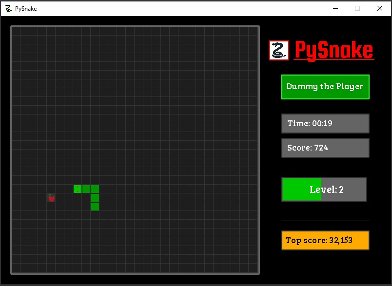
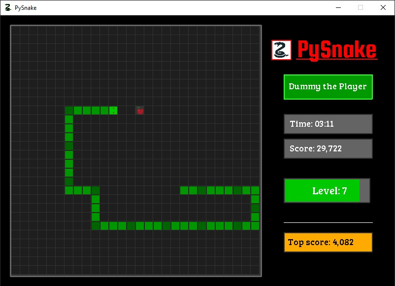

# PySnake
### Python Game for fun and machine learning (ML)purposes for later

This is the first version of the Snake game to try out the pygame library.  
Pygame is a python library, to create UI for a game, desktop application and so on...
[more info](https://www.pygame.org/wiki/about)
---

The final goal is to create a ML neural network with reinforcement learning, and test on the game.
 
:warning: The upcoming versions will go in that direction.

**Some screenshoot of the game:**

